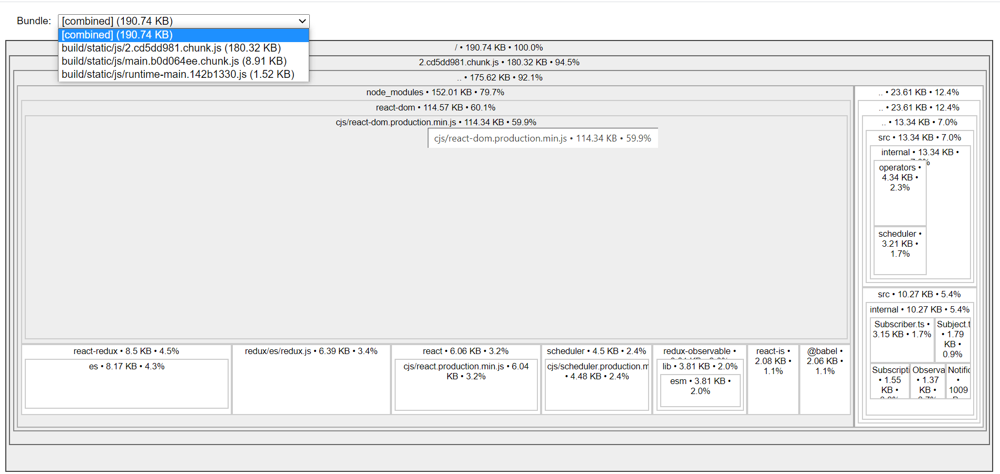

# SPACEX LAUNCHING PROGRAM DETAILS

### Author : Raghavendra KS

This is an application developed for SpaceX, integrated with API to display launches based on year and other parameters.

### Deployed on Netlify:

[View Spacex Launches](https://spacex-p.netlify.app/)

### COMMANDS
yarn build  - for production build

yarn start - for development (PORT - 3000)

yarn build:server for server side rendering

### Scaffolded from create-react-app

### TECH STACK
REACT

REDUX

REDUX OBSERVABLE

CSS MODULES 

### TESTING 

JEST

### TYPE CHECK

REACT PROPTYPES

FLOW

Built on React with strong support from redux and redux observable to achieve  maintainability

Self explanatory action names available in redux dev tools

React Component Library created with pure and simplest components with high re-usability and type checked.

Smart API request control with rxjs observables.

### Functional improvements

Lazy load images 

Add a loader while users wait for Launches results

Fetch data in batches(limit 10) and fetch more  as user scrolls (react-intersection-observer)

### Techincal improvements

Add more test cases

switch to typescipt for strong static type check

Code splitting on server side.

